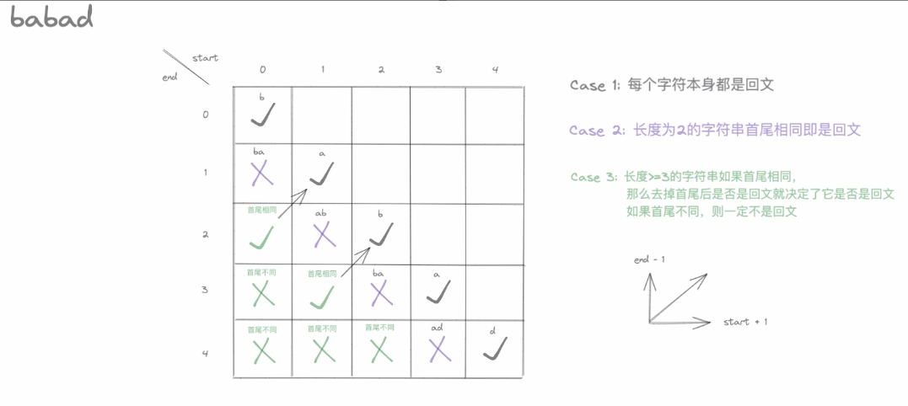

# 王二的力扣历程
[toc]
## 1. 两数之和 1×
这里我们使用 ``哈希表`` 来解决
>v2, ok := m["pear"]  // 如果键不存在，ok 的值为 false，v2 的值为该类型的零值
```go
package main

import "fmt"

var nums = []int{2, 7, 11, 15}
var target = 9

func main() {
	fmt.Printf("twoSum(nums, target): %v\n", twoSum(nums, target))
}

func twoSum(nums []int, target int) []int {
	result := map[int]int{} //初始化map的语句，后面的{}的赋初值为空,等同于下一句
	// result := make(map[int]int)

	fmt.Printf("result: %T\n", result)
	
	for i, v := range nums {
		if p, ok := result[target-v]; ok {
			return []int{p, i}
		} 
		result[v] = i
	}
	return nil
}

```

&emsp;&emsp;通过遍历逐步完善map
&emsp;&emsp;创建一个哈希表，对于每一个 x，我们首先查询哈希表中是否存在 target - x，然后将 x 插入到哈希表中，即可保证不会让 x 和自己匹配。
&emsp;&emsp;为了方便搜索，我们将索引值设置为期望target-v，将v的序列保存为后面的值
&emsp;&emsp;使用哈希表，可以将寻找 target - x 的时间复杂度降低到从 O(N) 降低到 O(1)。

## 2.两数相加 1×
&emsp;&emsp;在解决的过程中，遇到的难点在于int的位数，链表的递归查询即建立的问题
 &emsp;&emsp;并未自行解出来

### 链表的相关知识
&emsp;&emsp;链表有时会具有头节点，头节点的指针指向第一个节点的地址，其本身的数据域可以根据自己的选择进行赋值

#### 链表的创建:
``链表的结构定义``一般如下，即由本身的数据和指向下一个节点的指针构成
```go
type ListNode struct {
	Val  int
	Next *ListNode//不能直接赋值listnode，避免产生嵌套引用
}
```
&emsp;&emsp;``链表的创建（每个节点存储一位数字）``，在创建的过程中 我们需要设置中间的可变节点，不然我们可能会丢失对链表的第一个节点的索引，以下的例子中我们就使用middle为中间节点；将head设置为头节点，并代表完整的链表
##### 模拟方式建立
&emsp;&emsp;我们利用``迭代``的方法，只要还存在num，就更新创建一个新的节点
```go
// 尝试建立有头节点的链表，关键在于赋值给middle.next
func CreateList(nums int) *ListNode {
	Head := new(ListNode) //这代表一整个链表，并通过这里的头节点进行标注，方便该链表的引用

	middle := Head //middle视作Head链表的中间节点，其一直改变

	for nums > 0 {
		middle.Next = &ListNode{Val: nums % 10}//头节点赋值方法
		fmt.Printf("middle.Val: %v\n", middle.Val)
		middle = middle.Next
		nums /= 10
	}
	return Head
}
```
##### 链表的**递归创建**
```go
// 递归建立链表
func RecurCreateList(nums int) *ListNode {
	//在递归时好像不需要单独保存头节点位置，后续的位置会递归存储在next中，不用考虑被覆盖的问题
	middle := new(ListNode) //建立头指针，其指针不变

	// 123%10=3
	// 12.3%10=2
	// 1.23%10=1

	// 120%10=0
	// 12 %10=2
	// 1.2%10=1

	if nums > 1 || nums%10 > 0 {
		middle.Val = nums % 10
		fmt.Printf("middle.Val: %v\n", middle.Val)

		if nums > 1 {
			nums /= 10
			middle.Next = RecurCreateList(nums)
		}

	}
	return middle
}
```

#### 链表的读取
##### 遍历读取
&emsp;&emsp;链表读取时我们需要根据是否具有头节点进行一定的调整，下面是使用``遍历（迭代）``进行创建的过程
```go
// 尝试遍历读取链表
func ReadList(L ListNode) {
	middle := L //将头节点赋予这里的中间节点middle

	//循环读取链表的内容
	for middle.Next != nil {
		v := middle.Next.Val //由于我们这里判断的是本身节点是否为空，所以在输出时使用下一节点的值进行输出，避免错过某个值
		fmt.Printf("v: %v\n", v)
		// 	// fmt.Printf("L: %v\n", L)
		middle = *middle.Next
		// 	// fmt.Printf("L: %v\n", L)
	}
}
```
##### 递归读取
下面为使用**递归**进行读取的方法
由于节点的定义过程中使用``内嵌``，在建立相关函数时都`使用指针`比较方便[ 虽然前面都没注意:( ],
```go
// 尝试递归读取链表
func RecurReadList(L *ListNode) {

	fmt.Printf("L.Val: %v\n", L.Val) //打印出此节点中的Val

	//如果本结点的指针不为空，即还有下一个节点，继续读取
	if L.Next != nil {
		RecurReadList(L.Next) //将下个节点的指针传入
	}
	//如果运行到这里，说明指针为空，函数也就到此结束了
}


```

### 真正题目部分
这里选择使用递归方法进行解决
```go
package main

import "fmt"

type ListNode struct {
	Val  int
	Next *ListNode
}

func main() {
	//自定义初始化数据
	l1 := &ListNode{Val: 2, Next: &ListNode{Val: 4, Next: &ListNode{Val: 3}}}
	l2 := &ListNode{Val: 5, Next: &ListNode{Val: 6, Next: &ListNode{Val: 4}}}

	c := addTwoNumbers(l1, l2)
	RecurReadList(c)
}
//--------------------------------------------------------------------------------------------
// 递归方法解决
func addTwoNumbers(l1 *ListNode, l2 *ListNode) *ListNode {
	return addTwo(l1, l2, 0)
}

func addTwo(l1 *ListNode, l2 *ListNode, carry int) *ListNode {

	middle := &ListNode{}

	//递归传入的指针为空的话，说明计算到最后一位，最后只需要处理进位的问题即可
	if l1 == nil && l2 == nil {
		if carry == 1 {
			middle = &ListNode{Val: 1}
			return middle
		}
		return nil
	}

	//处理l1、l2任意一个不为1的情况
	if l1 != nil {
		middle.Val += l1.Val
		l1 = l1.Next
	}
	if l2 != nil {
		middle.Val += l2.Val
		l2 = l2.Next
	}
	middle.Val += carry
	//处理计算到最后的进位处理问题
	if middle.Val >= 10 {
		carry = 1
		middle.Val %= 10
	} else {
		carry = 0
	}

	middle.Next = addTwo(l1, l2, carry)
	return middle

}
//--------------------------------------------------------------------------------------
// 尝试递归读取链表
func RecurReadList(L *ListNode) {

	fmt.Printf("L.Val: %v\n", L.Val) //打印出此节点中的Val

	//如果本结点的指针不为空，即还有下一个节点，继续读取
	if L.Next != nil {
		RecurReadList(L.Next) //将下个节点的指针传入
	}
	//如果运行到这里，说明指针为空，函数也就到此结束了
}

```

## 3.无重复字符的最长子串 1×√
### 我的理解 第一版
```go
func lengthOfLongestSubstring(s string) int {
	//设置为每次保存最大个数的窗口
	//type Win map[string]int

	//每次循环的窗口
	n := make(map[string]int)

	//保存每次循环得到的最大值
	var Max int

	//记录每个窗口中最多的字母数
	i := 0
	var light int = 1     //用作窗口的左侧指针
	for c, v := range s { //c+1用来记录找到第几个位置
		//fmt.Println(string(v))
		fmt.Println(n)
		fmt.Println("c+1(n):", c+1)

		_, ok := n[string(v)]

		//fmt.Println(ok)

		if ok { //如果有对应的字母，说明有重复
			//先进行计算，再进行下一个窗口的布置
			if n[string(v)] >= light { //如果这个重复的字母在light的右边，则需要用这个字母的位置进行最长长度的jisuan
				fmt.Println("一")
				i = c + 1 - n[string(v)]
			} else { //否则用light计算即可
				fmt.Println("二")
				i = c + 1 - light
			}

			light = max(light, n[string(v)]) //更新light的位置
			n[string(v)] = c + 1             //更新重复字母最后的位置
			fmt.Println("light:", light)

			fmt.Println("i:", i)

		} else { //如果没有对应的字母1.最长长度计数+1 2.将临时最长长度长度保存

			n[string(v)] = c + 1
			i++
		}

		//在遍历的过程中不断更新最长长度，防止最后一段字母是最长的
		if i >= Max {
			Max = i
			fmt.Println("MAX:", Max)
		}
	}
	return Max
}
```

### 进阶学习版本，即官方版本
```go
```
#### 滑动窗口以及map的相关知识
&emsp;&emsp;**滑动窗口(同向双指针)** 常用于 **子串** 以及 **子数组** 等相关格式
&emsp;&emsp;利用for range可以遍历字符串、数组等，得到的index可以作为**右指针**；**左指针**则根据要求进行调整即可‘
>map中delete函数的使用
	**func delete(m map[Type]Type1, key Type)**
删除m中字段为key的一条

### 自我反思 
&emsp;&emsp;第一版解法相对于官方的问题所在：
1.对于左指针的理解不够，没有理解滑动窗口的*滑动*精髓
2.没有利用好range过程中产生的排序

## 4.找两个正序数组的中位数 1√
在本题中遇到了切片的某些问题，这里进行记录
### 关于切片的扩容问题
&emsp;&emsp;如果在程序中出现下列提示：说明你建立的切片容量不够，超出索引：
>panic: runtime error: index out of range [0] with length 0

####  切片的创建
&emsp;&emsp;Go 语言中的切片是一种动态数组，它可以自动扩容和缩容以适应不同的数据量。在实际开发中，了解切片的扩容和缩容机制对于优化内存使用和提高程序性能至关重要。
切片的创建方式一般来说有三种
```go
//1.通过数组的切割进行切片的建立
nums:=[5]int{1,2,3}//初始化一个切片实例
slice：=nums[:]//注意切割无论是切割数组还是切片都是**``左闭右开``**
//var slice []int

//2.声明切片并初始化
//2.1
var slice []int//这种方式初始化的切片并未自动分配内存，**``长度和容量都为0``**
//2.2
slice:=[]int{1,2,3}//声明并初始化

//3.通过make函数进行建立 推荐※※
slice:=make([]int,3,5)//第一个参数是长度，第二个参数是容量

```

#### 切片的扩容
&emsp;&emsp;golang中当向切片中添加元素时，如果切片的容量不足，就会触发切片的扩容机制。

>切片的扩容会分配一个新的数组，并将原来的元素复制到新数组中。

&emsp;&emsp;新数组的长度通常是原数组长度的两倍，但是如果原数组长度小于 1024，新数组的长度会比原数组长度大 1 倍；如果原数组长度大于等于 1024，新数组的长度会比原数组长度大 1/4 倍。
&emsp;&emsp;切片的扩容可以通过内置函数 append 来实现。当切片容量不足时，调用 append 函数会触发切片的扩容。

>append函数签名如下：
**func Append(slice []int, items ...int) []int**

#### 切片的缩容
&emsp;&emsp;当从切片中删除元素时，如果切片的长度小于容量的 1/4，就会触发切片的缩容机制。切片的缩容会释放底层数组中未使用的空间。新数组的长度通常是原数组长度的一半，但是如果原数组长度小于 1024，新数组的长度等于原数组长度；如果原数组长度大于等于 1024，新数组的长度会比原数组长度小 1/2 倍。

&emsp;&emsp;切片的缩容不需要显式调用任何函数，Go 语言的垃圾回收机制会自动进行。
&emsp;&emsp;切片的缩容使用我们前面提到的**切割**即可实现

### 二分查找法(第k小数)<span id="jump2"><span>
[更加详细部分](#jump)
&emsp;&emsp;二分查找用于在**有序**且**不重复**的元素列表中寻找需要的元素，返回其位置或错误

&emsp;&emsp;当要求算法的时间复杂度在**O（logn）**等带log的复杂度时，可以考虑二分查找法

由于在go中int类型计算时如果带小数，则取整，如``k=5;k/2=2``。通过此我们可以通过for循环来得到第k小数
```go
//如果我们这里寻找第9小的数，前面有8个位置
k:=9
for{
	k=k-k/2
	if k==1{
		break
	}
} 
// 9-9/2=5 4
// 5-5/2=3 2 
// 3-3/2=2 1
// 2-2/1=1 1
```


### 二分查找法我的代码
```go
func findMedianSortedArrays(nums1 []int, nums2 []int) float64 {
	z := len(nums1) + len(nums2) //两个数组的总的长度
	if z%2 == 1 {                //奇数
		return float64(Get(nums1, nums2, (z+1)/2)) //奇数的中位数为中间的一个数
	} else { //偶数
		return (float64(Get(nums1, nums2, z/2) + Get(nums1, nums2, z/2+1))) / 2 //偶数的中位数为中间二数的平均值
	}
}

// Get 作用为获取nums1和nums2中的第k小数
func Get(nums1 []int, nums2 []int, k int) int {
	var Rindex1, Rindex2 = 0, 0 //为我们总的偏移量
	offset1, offset2 := 0, 0    //当前一次循环的偏移量

	var flow int = 0 //定义flow为我们要求的数组的查询位置超限

	for {
		//如果nums1或2已经查询完毕或者长度为0
		if Rindex1 == len(nums1) {
			return nums2[k+Rindex2-1]
		}
		if Rindex2 == len(nums2) {
			return nums1[k+Rindex1-1]
		}

		//k==1说明已经查询完毕，返回后一个数即为第k小数
		if k == 1 {

			return min(nums1[Rindex1], nums2[Rindex2])
		}

		//计算下一次循环的指针位置（没有越限情况）
		point1 := k/2 - 1 + Rindex1
		point2 := k/2 - 1 + Rindex2

		//判断有没有溢出，进行越位处理
		if k/2-1+Rindex1 > len(nums1)-1 {
			point1 = len(nums1) - 1
			flow = 1
		}
		if k/2-1+Rindex2 > len(nums2)-1 {
			point2 = len(nums2) - 1
			flow = 2
		}

		if flow == 1 || flow == 2 {
			if flow == 1 { //如果时数组1超限
				if nums1[point1] <= nums2[point2] {
					offset1 = len(nums1)
					k = k - len(nums1)
				} else {
					offset2 = k / 2
					k -= k / 2
				}

			}
			if flow == 2 { //如果是数组2超限
				if nums1[point1] <= nums2[point2] {
					offset1 = k / 2
					k -= k / 2
				} else {
					offset2 = len(nums2)
					k = k - len(nums2)
				}

			}

		} else {
			if nums1[point1] <= nums2[point2] {
				offset1 = k / 2
			} else {
				offset2 = k / 2
			}

			k -= k / 2
		}
		//计算总偏移量
		Rindex1 += offset1
		Rindex2 += offset2
		//重置单次偏移量及标志位
		offset1, offset2, flow = 0, 0, 0
	}

}
```
#### 官方版本
&emsp;&emsp;与官方相比，对与越限的处理不够简单
```go
func findMedianSortedArrays(nums1 []int, nums2 []int) float64 {
	totalLength := len(nums1) + len(nums2)
	if totalLength%2 == 1 {
		midIndex := totalLength / 2
		return float64(getKthElement(nums1, nums2, midIndex+1))
	} else {
		midIndex1, midIndex2 := totalLength/2-1, totalLength/2
		return float64(getKthElement(nums1, nums2, midIndex1+1)+getKthElement(nums1, nums2, midIndex2+1)) / 2.0
	}
	return 0
}

func getKthElement(nums1, nums2 []int, k int) int {
	index1, index2 := 0, 0
	for {
		if index1 == len(nums1) {
			return nums2[index2+k-1]
		}
		if index2 == len(nums2) {
			return nums1[index1+k-1]
		}
		if k == 1 {
			return min(nums1[index1], nums2[index2])
		}
		half := k / 2
		newIndex1 := min(index1+half, len(nums1)) - 1
		newIndex2 := min(index2+half, len(nums2)) - 1
		pivot1, pivot2 := nums1[newIndex1], nums2[newIndex2]
		if pivot1 <= pivot2 {
			k -= (newIndex1 - index1 + 1)
			index1 = newIndex1 + 1
		} else {
			k -= (newIndex2 - index2 + 1)
			index2 = newIndex2 + 1
		}
	}
	return 0
}

func min(x, y int) int {
	if x < y {
		return x
	}
	return y
}
```


## 5.最长回文子串 1×
### 我的思路
1. 从两侧开始找相同的字符，再向内寻找相同的字符，但是在如何循环进行查找无法实现
2. 每个字符查看有无相近的两个，从每个这样的实例开始向外扩散求解，也是在循环的建立以及每个字符相近部分的指针保存上有问题
&emsp;&emsp;简而言之，上面两种思路我都没有实现

### 正确解法
1. 动态规划
1.1 什么是动态规划
&emsp;&emsp;通过组合**子问题**的解来求解原问题，与**分治**方法类似。分治方法将问题划分为互不相交的子问题，递归求解子问题，再组合。
&emsp;&emsp;而我们这里的**动态规划**是子问题具有公共的子问题。通过其子子问题的解影响子问题。
1.2 动态规划的应用场景
&emsp;&emsp;动态规划方法一般用来求解**最优化问题**。这类问题可以有很多可行解，每个解都有一个值，我们希望找到具有最优值的解，我们称这样的解为问题的一个最优解，而不是最优解，因为可能有**多个解都达到最优值**。
1.3 动态规划的步骤
&emsp;&emsp;1、定义一个状态，这是一个最优解的结构特征
&emsp;&emsp;2、进行状态递推，得到递推公式---我们这里的 **动态转移方程** 即为 子子串为回文 **且** 本次两个字符相等
&emsp;&emsp;3、进行初始化
&emsp;&emsp;4、返回结果
&emsp;&emsp;每次计算将其解保存在表格中，后续求解进行查询
1.4 具体实现
&emsp;&emsp;由于回文子串在去掉最外面的两个字符之后依旧是回文子串，所以非常典型地满足回文子串的特性。
&emsp;&emsp;用于参考的图片：



**思路：**
&emsp;&emsp;依旧是从头开始遍历字符串的每个可能为中心的字符，利用动态规划寻找改字符为中心的最长回文。比较后返回整体最长的回文子串。

**代码实现：**
&emsp;&emsp;
```go
func main() {
	s := "aacabdkacaa"
	r := longestPalindrome(s)
	fmt.Println(r)
}

func longestPalindrome(s string) string {
	length := len(s) //字符串长度
	var X, Y, M = 0, 0, 0
	table := make([][]int, length) //用于保存信息的表格
	for i := 0; i < length; i++ {
		table[i] = make([]int, length)
	}
	//fmt.Println(table)

	////首先将对角线的元素都标记为回文字符串
	//for i := 0; i < length; i++ {
	//	table[i][i] = 0
	//}
	//不需要以上定义，初始化表格的过程中自动赋值为0
	//为了方便，我们直接通过初始化将所有标记为0，意味都为回文子串，通过挨个修正来得到正确结果
	//其目的是为了省略对没有左下角数据的字符的额外判断

	//从第一行开始遍历
	for x := 0; x < length; x++ {
		for y := x + 1; y < length; y++ {
			u := y - x - 1 //大X为实际对应的表格内坐标
			//状态转移方程中的对于子子串的判断在没有左下角的数据时是不启用的
			if s[u] == s[y] && table[u+1][y-1] == 0 { //如果是回文子串，记录其长度
				if y-u >= M { //判断当前回文子串是否为最长回文子串
					M = y - u
					X = u
					Y = y
				}
				//table[u][y] = 0
			} else {
				table[u][y] = 1
			}

		}
	}
	//for _, ints := range table {
	//	fmt.Println(ints)
	//}
	n := s[X : Y+1]
	return n
}

```

## 代码随想录大时代
### 数组
#### 数组理论基础
数组的关键：
>数组下标从0开始
数组内存空间地址是连续的

#### 二分查找 leetcode704<span id="jump"><span>
[前面部分第4题，包括使用条件等](#jump2)
[感谢代码随想录：）](https://www.programmercarl.com/0704.%E4%BA%8C%E5%88%86%E6%9F%A5%E6%89%BE.html#%E7%AE%97%E6%B3%95%E5%85%AC%E5%BC%80%E8%AF%BE)
&emsp;&emsp;二分查找法中对于 **区间** 的定义

&emsp;&emsp;二分查找涉及的很多的**边界条件**，逻辑比较简单，但就是写不好。例如到底是 ``while(left < right)`` 还是 ``while(left <= right)``，到底是``right = middle``呢，还是要``right = middle - 1``呢？

&emsp;&emsp;对于二分法的区间定义，可以有闭区间、左闭右开、左开右闭等多种写法，他们的含义是我们寻找的**target**与左右指针的关系
与此相关的自然就会产生**循环条件的判断** 以及 **每次循环的左右指针的偏移** 的定义问题
以下为闭区间版本的写法：
```go
// 学习版本二分查找
func search(nums []int, target int) int {
	high := len(nums) - 1
	low := 0
	for low <= high { //在闭区间中如[1，1]是有意义的
		mid := low + (high-low)/2 //这样定义防止数字太大溢出
		if nums[mid] == target {
			return mid
		} else if nums[mid] > target { //缩小target所在的区间，由于为闭区间，可以舍弃上次的边界值
			high = mid - 1
		} else {
			low = mid + 1
		}
	}
	return -1
}

```
左闭右开区间版本：
```go
// 左闭右开区间版本
func search(nums []int, target int) int {
	high := len(nums) //由于右开，取不到最右边的数，所以这里不用-1也不会超限
	low := 0
	for low < high { //类似于[1,1)这样的区间是没有意义的
		mid := low + (high-low)/2 //同样防止溢出
		if nums[mid] == target {
			return mid
		} else if nums[mid] > target {
			high = mid //右开，不需要舍弃右边值
		} else {
			low = mid + 1 //左开，当前值不符合，抛弃当前值
		}
	}
	return -1
}

```

#### 移除元素 leetcode27
&emsp;&emsp;go中数据类型的分类：
1.**值**类型：int、float、bool、string、数组、结构体
2.**引用**类型：指针、切片、map、管道、接口

&emsp;&emsp;由于切片为引用类型，其本质是基于数组完成的，因此我们操作切片可以理解为操作底层的数组。

##### 暴力解法
&emsp;&emsp;第一个for循环遍历切片，第二个for循环将部分数组前移


##### 双指针法
1. 快慢指针
&emsp;&emsp;双指针法（快慢指针法）： 通过一个**快指针**和**慢指针**在**一个for循环**下完成两个for循环的工作。
&emsp;&emsp;在c中erase函数删除元素是将数组中当前位置后面的元素都向前移动一位，其时间复杂度为**O（n）**
&emsp;&emsp;而go中切片的截取（s[:]和append方法），都是通过修改指向底层的数组的指针实现，对于删除头部和尾部元素的时间复杂度为**O（1）**，中间元素的删除则同样为**O（n）**
&emsp;&emsp;完整代码如下，包含学习过程
```go
package main

import "fmt"

func main() {
	nums := []int{3, 2, 2, 3}
	val := 3
	c := removeElement(nums, val)
	fmt.Println(c)
	fmt.Println(nums)
}

// 暴力解法
/*func removeElement(nums []int, val int) int {
	length := len(nums)
	if length == 0 {
		return 0
	}

	c := length
	for i, v := range nums {
		if v == val {
			putOff(nums, i, val, length)
			c--
		}
		for nums[i] == val {
			putOff(nums, i, val, length)
			c--
		}

	}
	if nums[0] == val {
		return 0

	}
	return c
}

func putOff(nums []int, i int, val int, length int) {
	if i == length-1 {
		nums[length-1] = val - 1
		return
	}
	nums[i] = nums[i+1]
	putOff(nums, i+1, val, length)
}*/

// 双指针法 这里的解法还是有问题，在对应fast指针更新时，不作更新，只进行fast的右移，可以减少代码量
/*func removeElement(nums []int, val int) int {
	var fast, slow = 0, 0
	length := len(nums)
	for fast < length {
		for nums[fast] == val {
			fast++
			if fast == length {
				return length - fast + slow
			}
		}
		//if nums[slow] == val {
		//
		//}
		nums[slow] = nums[fast]
		slow++
		fast++
	}
	return length - fast + slow
}*/

// 改进双指针，最终版
func removeElement(nums []int, val int) int {
	var fast, slow = 0, 0
	length := len(nums)
	for fast < length {
		if nums[fast] != val { //如果fast对应值不是val，则可以写入
			nums[slow] = nums[fast]
			slow++
		}
		//如果fast对应等于val，则fast移位，不进行更新操作
		fast++

	}
	return slow
}

```
2. 双向指针
```go
//相向双指针法
func removeElement(nums []int, val int) int {
    // 有点像二分查找的左闭右闭区间 所以下面是<=
	left := 0
	right := len(nums) - 1
	for left <= right {
		// 不断寻找左侧的val和右侧的非val 找到时交换位置 目的是将val全覆盖掉
		for left <= right && nums[left] != val {
			left++
		}
		for left <= right && nums[right] == val {
			right--
		}
		//各自找到后开始覆盖 覆盖后继续寻找
		if left < right {
			nums[left] = nums[right]
			left++
			right--
		}
	}
	fmt.Println(nums)
	return left
}
```

#### 有序数组的平方 leetcode977
##### 个人的初次尝试
已经想到双指针法，但是对于循环的边界条件仍然找不明白，对于特殊情况没有适应性，很容易出错
而且在更改的过程中喜欢钻牛角尖，不更改现有的惯性思维，后续需要更正这些缺点。
##### 双指针法
1. 中心法
先找中心位置，从中心开始双指针 从小到大
```go

// 中心位置法，先找到正负交界处的值
func sortedSquares(nums []int) []int {
	//找交界,我们这里找最小的正数
	var i int                //最小正数的序列
	L := len(nums)           //定义nums数组的长度
	result := make([]int, L) //新建结果数组

	for i = 0; nums[i] <= 0; {
		i++
		if i == L {
			break
		}
	}
	// fmt.Println(nums[i])

	//从中心向两边
	// 1.左边到边界
	// 2.右边到边界
	n := 0                      //result的序列
	var nag, pos = i - 1, i     //定义正负两边的指针
	for nag != -1 || pos != L { //循环到边界值，两个都到边界值说明所有值都填完

		if nag == -1 { //非正填完，直接填正即可
			result[n] = nums[pos] * nums[pos]
			pos++
			n++
			continue
		}
		if pos == L { //正填完，直接填非正即可
			result[n] = nums[nag] * nums[nag]
			nag--
			n++
			continue
		}

		if -nums[nag] < nums[pos] { //非正部分小于正，填非正,nag-1
			result[n] = nums[nag] * nums[nag]
			nag--
		} else { //非正部分大于等于正，填正，pos+1
			result[n] = nums[pos] * nums[pos]
			pos++
		}
		n++
	}

	return result
}

```
这里仍旧有瑕疵，比如我们这里在寻找最小正数时，可以将判断n是否等于L加入到判断条件中，而不使用break。后面的填入数字过程中也可以使用多个if else进行判断，不使用continue
2. 两侧双指针
```go
// 两侧双指针法
func sortedSquares(nums []int) []int {
	//由于给定的数组是非递减排序，所以两侧的数平方是最大的，我们从两侧中间寻找最大值反向填充结果数组
	L := len(nums)
	left, right := 0, L-1 //定义左右两侧的指针
	result := make([]int, L)
	index := L - 1 //结果切边填入序列

	for left != right { //当左右指针重合时，说明所有数据已经填充完毕
		leftVal := nums[left] * nums[left]
		rightVal := nums[right] * nums[right]
		if leftVal >= rightVal { //左边值大，填入左边值
			result[index] = leftVal
			left++
		} else {
			result[index] = rightVal
			right--
		}
		index--

	}
	result[0] = nums[left] * nums[right]
	return result
}
```

#### 长度最小的子数组 leetcode209
##### 初次尝试之动态规划 × 超出内存限制
利用如下图所示的思想，但是使用的空间太大了

```go
// 动态规划方法 超出内存限制
func minSubArrayLen(target int, nums []int) int {
	L := len(nums)
	table := make([][]int, L)

	length := 0
	for i := 0; i < L; i++ {
		if nums[i] >= target {
			length = 1
			return length
		}
		table[i] = make([]int, L) //结果表
		table[i][i] = nums[i]     //对角线就是原本数据

		//fmt.Println(table[i])
	}

	//x, y := 0, 1

	//char := 0
outLoop:
	for i := 0; i < L-1; i++ {
		x := 0 //行数都是从0开始
		for y := i + 1; y < L; y++ {
			table[x][y] = table[x][y-1] + table[x+1][y] - table[x+1][y-1]
			if table[x][y] >= target { //如果当前的连续已经超过或等于target
				length = y - x + 1
				break outLoop //第一个大于target的目标即为最短的连续数组
			}
			x++
		}

	}

	for i := 0; i < L; i++ {
		fmt.Println(table[i])
	}

	return length
}
```
##### 滑动窗口(?)我的猪鼻版本
```go
func minSubArrayLen(target int, nums []int) int {
	L := len(nums)
	n := 0 //n用来计算最小的连续数

	left := 0
	right := 0
	add := 0

	for { //第一个for用来找到第一组满足要求的连续数，后续再进行缩小
		right = left + n
		if right == L {
			return 0
		}
		add += nums[right]
		n++
		if add >= target {
			N := n - 1
			for left != L { //第二个for进行缩小
				add -= nums[left]
				left++
				if add >= target {
					n--
					N = n - 1
					continue
				}
				right = left + N
				if right == L {
					break
				}
				add += nums[right]
			}

			return n
		}
	}

}
```

##### 正宗版滑动窗口
```go
func minSubArrayLen(target int, nums []int) int {
	add := 0
	left, right := 0, 0
	L := len(nums)
	length := L + 1 //为了方便判断有无总和超过target

	for right != L {
		add += nums[right]
		for add >= target { //当 当前 窗口内总和大于等于 target 为边界条件；
			length = min(length, right-left+1) //更新最短长度
			add -= nums[left]                  //删除画出的数据
			left++                             //左指针右移
		}
		right++

	}
	if length == L+1 {
		return 0
	}
	return length
}
```


#### 螺旋矩阵 leetcode59
##### 初次尝试，从中心向外
```go
func main() {
	n := 3
	fmt.Println(generateMatrix(n))
}

// 初版，我们从中心点开始
func generateMatrix(n int) [][]int {
	//1.nXn矩阵
	table := make([][]int, n)
	for i := 0; i < n; i++ {
		table[i] = make([]int, n)
		//fmt.Println(table[i]) //确认生成n*n
	}

	//2.确定中心点位置
	//n=1,	(0,0)
	//n=2,	(1,0)
	//n=3,	(1,1)
	//n=4,	(2,1)
	var x, y = 0, 0 //中心点坐标
	x = n / 2
	y = (n - 1) / 2
	fmt.Println("n:", n, "	x:", x, "	y:", y)
	table[x][y] = n * n

	//3.填充

	var char = 0  //都是从横行开始移动, 横竖移动标志位
	var char2 int //到底是向左还是向右
	var char3 int //到底是向上还是向下

	if n%2 == 1 {
		char3 = 1
		char2 = -1
	} else {
		char3 = -1
		char2 = 1
	}
	var c = 1
	for t, i := 1, n*n-1; i >= 0; { //总共填入n*n个数 ,t为当前运行的次数，i为本次填入的数据

		for e := 0; e < 2; e++ {

			tem := (c + 1) / 2 //1,1,2,2,3,3

			if char == 0 { //横着动
				for tem > 0 {
					y = y + char2
					if y == n+1 || y == -1 {
						return table
					}
					table[x][y] = i
					i--
					t++

					tem--
				}
				char2 = -char2
				char = 1
			} else { //竖着动
				for tem > 0 {
					x = x + char3
					if x == n+1 || x == -1 {
						return table
					}
					table[x][y] = i
					i--
					t++
					if t == n*n {
						return table
					}
					tem--
				}
				char3 = -char3
				char = 0

			}
			c++
		}
	}

	return table
}

```

##### 模拟方式
```go
func generateMatrix(n int) [][]int {

	//1.nXn矩阵
	table := make([][]int, n)
	for i := 0; i < n; i++ {
		table[i] = make([]int, n)
		//fmt.Println(table[i]) //确认生成n*n
	}

	i := 1 //需要填入的数据

	c := n - 1

	layerNums := 0            //第几层

	for ; c >= 0; c = c - 2 { //记每次循环每层每边中间间隔的个数，c=0时为最后中心只有一个数的那层
	//n=2 2X2 C:1
	//n=3 3X3 C:2 -> 0
	/*
	1 2 3 
	4 5 6
	7 8 9
 	*/
	//n=4 4X4 C:3 -> 1 
	/* 
	1  2  3  4
	12 13 14 5
	11 16 15 6
	10  9  8 7
	*/
	
	x, y := layerNums, layerNums //记每层模拟的起始点
		table[x][y] = i
		for b := 0; b < c; b++ {//先向右横
			table[x][y] = i
			y++
			i++
		}
		for b := 0; b < c; b++ {//向下竖
			table[x][y] = i
			x++
			i++
		}
		for b := 0; b < c; b++ {//向左横
			table[x][y] = i
			y--
			i++
		}
		for b := 0; b < c; b++ {//向上竖
			table[x][y] = i
			x--
			i++
		}
		//由于我们写入实际在下次循环才写入，所以最后一位的原点实际并未覆盖


		layerNums++//层数计数加一
	}

	return table
}

```

### 链表
更多有关于go链表的内容可以见这篇文章[链表的创建和读取](https://blog.csdn.net/kingsill/article/details/134968248?spm=1001.2014.3001.5501)
#### 链表基础知识部分
什么是**链表**，链表是一种通过**指针**串联在一起的**线性结构**，每一个节点由两部分组成，一个是**数据域**一个是**指针域**（存放指向下一个节点的指针），最后一个节点的指针域指向null（空指针的意思）。

链表的入口节点称为链表的**头结点**也就是`head`

- 链表类型
	- 单链表
	
	如上
	- 双链表：	 
	每一个节点有两个指针域，一个指向下一个节点，一个指向上一个节点。
	
	- 循环链表
	链表首尾相连
	

##### 链表的存储方式
数组是在内存中是连续分布的，但是链表在内存中可不是连续分布的。

##### 链表的定义
go语言：单链表
```go
type ListNode struct {
      Val int 		//数据域
      Next *ListNode//指针域
}
```

##### 链表的操作
1. 节点删除
只需要将删除的节点后面的节点连接到前面的节点即可
由于go有自己的内存回收机制，删除的节点不用再手动释放

2. 添加节点
将要添加的节点指针域指向后面的节点，前面的指针域替换为要添加节点的


##### 性能分析
|时间复杂度|插入/删除|查询|适用场景|
|:---:|---|---|---|
|数组|O(n)|O(1)|数据量固定，频繁查询，较少增删|
|链表|O(1)|O(n)|数据量不固定，频繁增删，较少查询|

数组在定义的时候，长度就是固定的，如果想改动数组的长度，就需要重新定义一个新的数组。

链表的长度可以是不固定的，并且可以动态增删， 适合数据量不固定，频繁增删，较少查询的场景。

更多有关于go链表的内容可以见这篇文章[链表的创建和读取](https://blog.csdn.net/kingsill/article/details/134968248?spm=1001.2014.3001.5501)


#### 移除链表元素 leetcode203

##### 初版方法 迭代 虚拟头节点
使用迭代解决 ，虚拟头节点
没有使用给出的链表，选择重建了一个链表，时间、空间复杂度都增加
```go
func removeElements(head *ListNode, val int) *ListNode {
	//遍历节点

	//targetList := new(ListNode) //golang自建类型可以使用make，如slice等；这里我们自定义类型使用new，new返回指针
	targetList := &ListNode{} //直接实例化，可能更快

	middle := targetList //target作为头节点

	for head != nil {
		if head.Val == val { //检测链表中的val是否等于val

		} else { //如果不用删除，直接赋值
			middle.Next = &ListNode{Val: head.Val}
			middle = middle.Next
		}
		head = head.Next
	}

	return targetList.Next
}

```

##### 改进 迭代 虚拟头节点
```go
// 新版本 迭代 虚拟头节点
func removeElements(head *ListNode, val int) *ListNode {
	dummyHead := new(ListNode) //dummyHead为虚拟头节点
	dummyHead.Next = head      //定义虚拟头节点的下一个节点为原链表第一个节点
	cur := dummyHead

	//虚拟头节点的使用可以不用考虑原链表的头节点的val为Val，不能直接删除的问题
	//我们检查的不是当前节点的val是否为Val，而是当前的next.val，是为了方便删除符合条件的节点；如果选择检查当前节点的val，则不好删除当前节点，大家可以编程体会

	//先定义逻辑
	//首先是循环的定义，只要head.next！=nil，就继续循环

	//如果原链表 循环到的节点的next.val为 给定的Val ，则将head.next->head.next.next,即下一个指针跳过当前节点,且此时这里是不保存下一个节点的，防止下一个节点的val也是Val
	//如果为空 ，则return dummyHead.next

	for cur.Next != nil {

		if cur.Next.Val == val {
			cur.Next = cur.Next.Next
		} else {
			cur = cur.Next
		}

	}

	return dummyHead.Next

}

```

###### 使用迭代 直接使用原链表 不使用头节点
```go
func removeElements(head *ListNode, val int) *ListNode {

	//依旧是先定义逻辑

	//如果是 原链表的头节点为val的话，直接将head=head。next，且当前过程持续，防止头节点后面的节点也为Val
	//这里前置循环 并且要判定head 是否为nil，防止出错

	//这之后再定义cur：=head
	//这里再判定cur.next.val如果等于val，cur.next=cur.next.next（具体原因看上面使用虚拟头节点部分），跳过下一个节点

	//注意：因为要判定不使用虚拟头节点，在循环中要判断循环到的节点是否为nil，防止出错

	for head != nil && head.Val == val {
		head = head.Next
	}
	cur := head

	for cur != nil && cur.Next != nil {
		if cur.Next.Val == val {
			cur.Next = cur.Next.Next
		} else {
			cur = cur.Next
		}
	}

	return head

}

```

###### 递归方法 
首先是建立链表的思路
我选择寻求gpt的帮助 ：）

构建递归的思路通常遵循以下几个步骤：
- **确定递归结束条件**：这是最重要的一步，递归必须有一个明确的结束条件，否则会导致无限递归和栈溢出。结束条件通常是当问题规模缩减到最小或达到某个特定状态时。

- **找到问题的递归式**：确定如何将问题分解成更小的子问题。递归的核心思想是将大问题分解成结构或逻辑上类似的小问题。

- **调用自身解决子问题**：在函数中调用自身（递归调用）来解决这些子问题。这些子问题的解决方式应与原问题相同。

- **整合子问题的解决结果**：递归调用后，通常需要整合或处理这些子问题的结果来得到最终答案。

- **优化（可选）**：对于某些递归问题，可能会出现重复计算的情况，可以通过技巧如记忆化（memoization）来优化性能。

那么我们将结合leetcode203进行上述思路进行解题


要使用递归方法解决删除链表中所有满足 Node.val == val 的节点问题，可以遵循以下递归思路：

- **递归结束条件**：当当前节点为 null 时，表示已经到达链表末尾，递归结束。在这种情况下，直接返回 null。

- **递归式**：
	检查当前节点（假设为 head）的值是否等于 val。
	如果是，我们需要删除这个节点，这意味着需要将其父节点（递归中的上一个节点）连接到它的下一个节点。
	但在递归中，我们没有直接的方式来访问父节点，因此我们通过返回下一个节点（head.next）来实现这一点。

- **调用自身**：对于每个节点，调用递归函数处理它的下一个节点（即，调用自身传递 head.next 和 val）。

- **整合子问题的解决结果**：如果当前节点的值不等于 val，那么我们需要保留这个节点，并将其 next 指针指向递归调用的结果。否则，直接返回递归调用的结果，即 head.next 的递归处理结果。

- **返回新的头节点**：递归的最终结果是新的链表头节点，它可能与原始链表的头节点不同，尤其是当原始头节点的值等于 val 时。

```go
// 递归
func removeElements(head *ListNode, val int) *ListNode {

	//放在递归开头的为 结束条件 ，其应该return一个结果，结束本次递归
	//即本次递归传入的 head为空，不再进行后续递归，将尾节点设置为空
	if head != nil {
		return head
	}

	//调用自身
	//修改子节点
	head.Next = removeElements(head.Next, val) //我们也可以通过这个式子理解 下面的返回 返回到.next

	//递归式-整合子问题的解决成果
	//返回到父节点
	if head.Val == val {
		return head.Next //如果当前节点的val等于val则舍弃该节点
	}
	return head
}

```

#### 设计链表 Leetcode707
题目要求我们通过实现几个方法来完成对链表的各个操作
由于在go语言中都为值传递，（注意这里与值类型、引用类型的而区别），所以即使我们直接在方法中传入指针，但是我们在方法里是不能直接修改指针所改的地址，其在方法中只会复制一份副本进行操作，而不会影响到原变量。
所以我们这里可以设置一个结构体，在mylinkedlist中在定义链表节点进行解决。
[关于值传递的注意事项](https://juejin.cn/post/7221730647043244090)

这里放一个经典的愚蠢案例以作警戒，妄想通过副本直接影响原链表
我是猪
```go
func (this *MyLinkedList) AddAtTail(val int) {
	Node := this.Head
	if Node == nil {
		Node = &ListNode{Val: val}
		//this.Head = Node
		return
	}
	for Node.Next != nil {
		Node = Node.Next
	}
	Node.Next = &ListNode{Val: val}
}
```
##### 不使用头节点
```go
// ListNode 定义链表结构
type ListNode struct {
	Val  int
	Next *ListNode
}

//正常建立，不涉及头节点
// MyLinkedList 为了方便操作链表建立的结构体
type MyLinkedList struct {
	size int
	Head *ListNode
}

// Constructor 初始化链表对象 √
func Constructor() MyLinkedList {
	return MyLinkedList{}
}

// Get 获取第index个节点的数据 √
func (this *MyLinkedList) Get(index int) int {
	if index+1 > this.size {
		return -1
	}

	Node := this.Head

	for ; index > 0; index-- {
		Node = Node.Next
	}

	return Node.Val
}

// AddAtHead 将数据为val的节点添加到第一位 √
func (this *MyLinkedList) AddAtHead(val int) {
	Node := &ListNode{Val: val, Next: this.Head}
	this.Head = Node
	this.size++
}

// AddAtTail 将数据为val的节点添加到最后一位 √
func (this *MyLinkedList) AddAtTail(val int) {
	this.size++
	if this.Head == nil {
		this.Head = &ListNode{Val: val}
		return
	}
	Node := this.Head
	for Node.Next != nil {
		Node = Node.Next
	}
	Node.Next = &ListNode{Val: val}
}

// AddAtIndex 将数据为val的节点插入到第index个节点之前；若链表长度为index，则放置到最后一位；若超过链表长度不做修改 √
func (this *MyLinkedList) AddAtIndex(index int, val int) {
	if this.size == index {
		this.AddAtTail(val)
		return
	}
	if this.size < index {
		return
	}
	//有第index节点
	//如果index=0，则需要改动首结点，直接待用addAtHead
	if index == 0 {
		this.AddAtHead(val)
		return
	}

	cur := this.Head
	Node := cur

	//0 1 2 3	;index=2
	for ; index > 1; index-- {
		Node = Node.Next
	}
	Node.Next = &ListNode{Val: val, Next: Node.Next}
	this.Head = cur
	this.size++
}

// DeleteAtIndex 删除第index个节点
func (this *MyLinkedList) DeleteAtIndex(index int) {
	if index+1 > this.size {
		return
	}

	// 0 1 2 3	;index=0
	//如果index=0，依旧需要修改头节点
	if index == 0 {
		this.Head = this.Head.Next
		this.size--
		return
	}

	Node := this.Head
	cur := Node

	////0 1 2 3	;index=3,删除最后一个，只需要将最后.next=nil
	//if index+1 == this.size {
	//	for ; index > 1; index-- {
	//		cur = cur.Next
	//	}
	//	cur.Next = nil
	//	this.Head = Node
	//	this.size--
	//	return
	//}
	//
	////0 1 2 3	;index=2
	//for ; index > 1; index-- {
	//	cur = cur.Next
	//}
	//cur.Next = cur.Next.Next
	//this.Head = Node
	//this.size--

	for ; index > 1; index-- {
		cur = cur.Next
	}
	if index+1 == this.size {
		cur.Next = nil
		this.size--
		return
	}
	cur.Next = cur.Next.Next
	this.Head = Node
	this.size--
}


```

##### 使用头节点 推荐**
```go
//本次目标时建立具有 头节点 的链表(虚拟头节点，但实际就是有头节点)
//链表结构：H* 0 1 2 3
//优势，在对头节点后的节点进行操作会方便

type MyLinkedList struct {
	Size      int
	DummyHead *ListNode
}

// Constructor 使用虚拟头节点时，很关键的一步在在初始化我们的mylinkedlist，我们需要直接对dummyhead分配内存空间，防止后续对首个节点进行操作时出现问题
func Constructor() MyLinkedList {
	return MyLinkedList{DummyHead: &ListNode{}}
}

func (this *MyLinkedList) Get(index int) int {
	//*h 0 1 2 3	;0
	if this.Size <= index {
		return -1
	}

	DummyHead := this.DummyHead
	cur := DummyHead

	for ; index >= 0; index-- {
		cur = cur.Next
	}

	return cur.Val
}

func (this *MyLinkedList) AddAtHead(val int) {

	//if this.Size == 0 {
	//	this.Head = &ListNode{Next: &ListNode{Val: val}}
	//	this.Size++
	//} else {
	//	this.Head.Next = &ListNode{Val: val, Next: this.Head.Next}
	//	this.Size++
	//}

	//newNode := &ListNode{Val: val} // 创建新节点
	//newNode.Next = this.Head.Next  // 新节点指向当前头节点
	//this.Head.Next = newNode       // 新节点变为头节点
	//this.Size++                    // 链表大小增加1

	//上面第一块没想明白，逻辑有问题；第二部分进行整合，本质一样
	this.DummyHead.Next = &ListNode{Val: val, Next: this.DummyHead.Next}
	this.Size++
}

func (this *MyLinkedList) AddAtTail(val int) {
	if this.Size == 0 {
		this.AddAtHead(val)
		return
	}
	DummyHead := this.DummyHead
	cur := DummyHead
	//h* 0 1 2 3 4	;
	for cur.Next != nil {
		cur = cur.Next
	}
	cur.Next = &ListNode{Val: val}
	this.DummyHead = DummyHead
	this.Size++
}

func (this *MyLinkedList) AddAtIndex(index int, val int) {
	//如果index=链表长度，插入到末尾
	if this.Size == index {
		this.AddAtTail(val)
		return
	}
	//如果index>链表长度，什么都不做

	//<长度，插入到index节点前
	//h* 0 1 2 3 4	；2
	if this.Size > index {
		DummyHead := this.DummyHead
		cur := DummyHead

		for ; index > 0; index-- {
			cur = cur.Next
		}
		cur.Next = &ListNode{Val: val, Next: cur.Next}
		this.DummyHead = DummyHead
		this.Size++
	}

}

func (this *MyLinkedList) DeleteAtIndex(index int) {
	//h* 0 1 2 3 4	;0

	if this.Size > index {
		DummyHead := this.DummyHead
		cur := DummyHead

		for ; index > 0; index-- {
			cur = cur.Next
		}
		cur.Next = cur.Next.Next
		this.DummyHead = DummyHead
		this.Size--
	}

}
```


#### 翻转链表 leetcode206 
至此走到这里，我们对于链表的结构应当已经比较熟悉，下面的就是敢于操作

##### 题解第一版 直接建立新的链表
时间复杂度太高
```go
// 初始方法，建立新链表
func reverseList(head *ListNode) *ListNode {
	NewNode := &ListNode{}

	for ; head != nil; head = head.Next {
		NewNode.Val = head.Val
		NewNode = &ListNode{Next: NewNode}
	}

	return NewNode.Next
}

```

##### 双指针迭代
其实在初始时也曾考虑过，最后没有直面的勇气，抽自己两个大嘴巴子，必须醒悟，fuckmyself
当时卡在觉得修改顺序会将链表后面的一大串也甩过来，现在发现多虑了
```go
// 迭代 双指针法
func reverseList(head *ListNode) *ListNode {

	////如果原链表为空或者nil，直接返回原链表
	//if head == nil || head.Next == nil {
	//	return head
	//}

	// 0 1 2 3 4
	cur := head

	//pre := &ListNode{}
	var pre *ListNode //这样定义不分配内存，在后续第一次向外赋值即为nil；而上面的定义则会为0

	//结果后续函数可以覆盖前面的特殊情况 ：）
	for cur != nil {
		c := cur.Next
		cur.Next = pre
		pre = cur
		cur = c
	}
	return pre

}

```

##### 递归法
链表的操作需要记住三个东西，上一个是谁，我是谁，下一个是谁。

用递归帮忙记住了上一个是谁，那么问题是我是谁，下一个是谁？第一行的if判断，是两种临界情况，第一种是头结点为空，不用管；第二种是没有下一个了，只用知道我是谁，直接返回就行。下面的几行代码，我明显是head，下一个就是head->next，由于要反转链表，我的下一个要变成我的上一个，因此head->next->next = head，我的上一个（递归）等到这层递归出去再解决。可以看到newHead在递归结束返回后是没有进行任何操作的，也就是返回的是最底层的那个，起到传递尾（新首）结点的作用

```go
// 递归，也为双指针
// 把自己和后面的换
func reverseList(head *ListNode) *ListNode {
	//递归结束条件
	if head == nil || head.Next == nil {
		return head
	}

	//调用自身
	newHead := reverseList(head.Next)

	//处理递归
	//由于翻转链表，那么我们的目的就是目前节点的下一个改为上一个
	//目前节点head.next
	head.Next.Next = head
	//上面这么写会使链表成环，这里要打破 环
	head.Next = nil

	return newHead
}
```

#### 两两交换链表中的节点 leetcode24 
##### 递归 两个节点一递归 
第一次即成功，泪目！！
```go
// 每两个进行一次交换
func swapPairs(head *ListNode) *ListNode {
	//每两个的第一个节点
	var pre *ListNode
	//递归结束条件，即当剩下的节点不满足两个时
	if head == nil || head.Next == nil {
		return head
	}

	//保留递归的子节点
	cur := head.Next.Next

	//交换本次的顺序
	pre = head.Next
	pre.Next = head

	//1 2 3 4 -> 2 1 4 3
	//第三个节点开始进行递归，且如果交换，指向的应该是交换过后的次序，即本来的第四个
	pre.Next.Next = swapPairs(cur)

	//将交换次序后的返回
	return pre

}
```

##### 迭代方法，虚拟头节点
```go
// 使用迭代方法
// 不能操之过急，这里前面迭代完连接的应当还是未交换过的次序
func swapPairs(head *ListNode) *ListNode {

	dummyHead := &ListNode{}
	cur := dummyHead //用来保存当前位置

	//赋予初始值
	cur.Next = head
	
	//结束条件，即后续节点不满足两个
	for cur.Next != nil && cur.Next.Next != nil {

		//要交换的两个节点记为node1和node2；下一次迭代的起始定义为next
		//h* 1 2 3 4
		node1 := cur.Next
		node2 := cur.Next.Next
		next := cur.Next.Next.Next

		//交换步骤
		cur.Next = node2
		node2.Next = node1
		node1.Next = next
		
		//更改下次迭代的开始节点
		cur = node1
	}

	//由于使用虚拟头节点，返回真实的链表
	return dummyHead.Next
}

```

#### 删除链表的倒数第N个节点 leetcode19

##### 递归
由于这里是删除倒数第N个节点，比较适合使用递归进行 从终到始 的运行
```go
func removeNthFromEnd(head *ListNode, n int) *ListNode {

	// 创建一个虚拟头节点，简化边界条件处理
	dummy := &ListNode{Next: head}

	//检查是否需要删除头节点
	//if remove(dummy, n) == n {
	//	return dummy.Next
	//}

	remove(dummy, n)
	return dummy.Next
}

func remove(node *ListNode, n int) int {

	//循环结束条件，找到最后一个节点
	if node == nil {
		return 0
	}

	index := remove(node.Next, n) + 1

	//如果当前节点的下一个节点是目标节点
	if index == n+1 {
		node.Next = node.Next.Next
	}

	return index
}

```

##### 双指针法 迭代
双指针的经典应用，如果要删除倒数第n个节点，让fast移动n步，然后让fast和slow同时移动，直到fast指向链表末尾。删掉slow所指向的节点就可以了。
同时也使用了虚拟头节点的方式
还可以


```go
// 双指针 迭代

func removeNthFromEnd(head *ListNode, n int) *ListNode {
	dummyHead := &ListNode{Next: head}
	fast, slow := dummyHead, dummyHead

	//fast和slow指针之间的差值
	var diff int

	//循环结束条件，fast移动到最后一个节点
	for fast.Next != nil {
		//如果差值到n，则fast和slow指针都向后偏移即可
		if diff == n {
			fast = fast.Next
			slow = slow.Next
		} else { //差值不到n，则只有fast指针移动，直到满足差值要求
			fast = fast.Next
			diff++
		}

	}

	if diff == n {
		slow.Next = slow.Next.Next
	}

	return dummyHead.Next
}

```


#### 相交链表 leetcode160 
由于链表深度不一致，所以不太好使用递归

- 检测方法 ：
  - 相交链表，即两个链表上一个节点的`Next`指向 同一个地址
  - 先检测同样Val值，再查看地址
使用map？

同时这里要求我们返回的是相交节点的 `Val`
##### 暴力求解 map
遍历
```go

func getIntersectionNode(headA, headB *ListNode) *ListNode {
	//考虑到从第一个节点就相交的情况，设立虚拟头节点
	DummyHeadA := &ListNode{Next: headA}
	DummyHeadB := &ListNode{Next: headB}

	//使用map进行记录
	var resultA = map[*ListNode]int{}
	var resultB = map[*ListNode]int{}

	//遍历两个链表
	for DummyHeadA.Next != nil || DummyHeadB.Next != nil {

		if DummyHeadA.Next == nil {
			resultB[DummyHeadB.Next] = DummyHeadB.Next.Val
			DummyHeadB = DummyHeadB.Next
		} else if DummyHeadB.Next == nil {
			resultA[DummyHeadA.Next] = DummyHeadA.Next.Val
			DummyHeadA = DummyHeadA.Next
		} else {
			resultA[DummyHeadA.Next] = DummyHeadA.Next.Val
			DummyHeadA = DummyHeadA.Next

			resultB[DummyHeadB.Next] = DummyHeadB.Next.Val
			DummyHeadB = DummyHeadB.Next
		}

		//检查map中是否记录相交节点
		if _, ok := resultA[DummyHeadB]; ok {
			return DummyHeadB
		}
		if _, ok := resultB[DummyHeadA]; ok {
			return DummyHeadA
		}

	}
	return nil
}


```
##### 双指针1
前面陷入思维误区，相交节点之后两个链表是完全一致的，所以我们可以忽略长链表比短链表长的一部分，
从长度一样的地方开始 两个链表同时遍历，相交节点一定位于**同一级**
```go
// 双指针
func getIntersectionNode(headA, headB *ListNode) *ListNode {

	//遍历两链表得到链表长度
	La := 0
	Lb := 0

	curA := headA
	curB := headB

	for curA != nil {
		curA = curA.Next
		La++
	}

	for curB != nil {
		curB = curB.Next
		Lb++
	}

	//将较长的链表偏移到和较短的链表一样长的位置
	if La > Lb {
		for diff := La - Lb; diff > 0; diff-- {
			headA = headA.Next
		}
	}

	if La <= Lb {
		for diff := Lb - La; diff > 0; diff-- {
			headB = headB.Next
		}
	}

	//同级每个节点进行比较，相同则为相交节点
	for headA != nil {

		if headA == headB {
			return headA
		}
		headA = headA.Next
		headB = headB.Next

	}

	return nil
}


```
##### 双指针2 巧妙 该部分源于leetcode官方题解
**思路和算法**
使用双指针的方法，可以将空间复杂度降至 O(1)O(1)O(1)。

只有当链表 `headA `和 `headB` 都不为空时，两个链表才可能相交。因此首先判断链表 `headA `和` headB` 是否为空，如果其中至少有一个链表为空，则两个链表一定不相交，返回` null`

当链表 `headA `和 `headB `都不为空时，创建两个指针 `pA` 和 `pB`，初始时分别指向两个链表的头节点` headA `和 `headB` ，然后将两个指针依次遍历两个链表的每个节点。具体做法如下：

每步操作需要同时更新指针` pA `和` pB`

如果指针 `pA` 不为空，则将指针 `pA` 移到下一个节点；如果指针 `pB `不为空，则将指针 `pB` 移到下一个节点。

如果指针 `pA`为空，则将指针 `pA `移到链表 headB 的头节点；如果指针 `pB` 为空，则将指针 `pB` 移到链表` headA` 的头节点。

当指针` pA `和` pB `指向同一个节点或者都为空时，返回它们指向的节点或者 `null`
```go
func getIntersectionNode(headA, headB *ListNode) *ListNode {
	if headA == nil || headB == nil {
		return nil
	}
	pa, pb := headA, headB
	for pa != pb {
		if pa == nil {
			pa = headB
		} else {
			pa = pa.Next
		}
		if pb == nil {
			pb = headA
		} else {
			pb = pb.Next
		}
	}
	return pa
}

```

下面提供双指针方法的正确性证明。考虑两种情况，第一种情况是两个链表相交，第二种情况是两个链表不相交。

- 情况一：两个链表相交

链表` headA `和 `headB `的长度分别是 `m` 和 `n`。假设链表 `headA` 的不相交部分有 `a `个节点，链表 `headB `的不相交部分有 `b` 个节点，两个链表相交的部分有 `c` 个节点，则有 `a+c=ma+c=ma+c=m，b+c=nb+c=nb+c=n`。

如果 a=b，则两个指针会同时到达两个链表相交的节点，此时返回相交的节点；

如果 `a≠b` ，则指针 `pA `会遍历完链表 `headA`，指针 `pB `会遍历完链表 `headB`，两个指针不会同时到达链表的尾节点，然后指针 `pA` 移到链表 `headB `的头节点，指针 `pB` 移到链表 `headA` 的头节点，然后两个指针继续移动，在指针` pA`  移动了 `a+c+b` 次、指针 `pB` 移动了 `b+c+a` 次之后，两个指针会同时到达两个链表相交的节点，该节点也是两个指针第一次同时指向的节点，此时返回相交的节点。

- 情况二：两个链表不相交

链表 `headA` 和` headB `的长度分别是 `m` 和 `n` 。考虑当 `m=n `和 `m≠n` 时，两个指针分别会如何移动：

如果 `m=n` ，则两个指针会同时到达两个链表的尾节点，然后同时变成空值 `null`，此时返回 `null`

如果 `m≠n`，则由于两个链表没有公共节点，两个指针也不会同时到达两个链表的尾节点，因此两个指针都会遍历完两个链表，在指针 `pA `移动了` m+n `次、指针` pB `移动了` n+m `次之后，两个指针会同时变成空值 `null`，此时返回 `null`。
#### 环形链表 leetcode142
该题目要求找到入环的第一个节点
我们可以通过map进行记录，没到新的节点查询是否经过原有节点
入环节点，上两个节点的next相同
若有入环节点，则一定能检测到；若没有，则总会到达最后节点
##### 暴力遍历 map哈希记录
```go
// 暴力遍历 map哈希表记录
func detectCycle(head *ListNode) *ListNode {
	dummyHead := &ListNode{Next: head}
	table := map[*ListNode]int{}

	//若不成环，会走出循环
	for dummyHead.Next != nil {

		if _, ok := table[dummyHead.Next]; ok {
			return dummyHead.Next
		}
		table[dummyHead.Next] = 1
		dummyHead = dummyHead.Next
	}
	return nil
}

```
时间、空间复杂度都为O（n）
##### 快慢指针法
思路解析
1. 什么如果成环，快指针一定会再慢指针没有转完一圈之前追上满指针？
   1. 由于快指针的移动速度为2，慢指针的移动速度为1， 二者**相对速度为1**
   所以当快指针跟在慢指针后面时有以下几种情况
       - 快指针落后2 -> 快指针落后1 ->重合
       - 快指针落后1 -> 重合
       - 快指针与慢指针重合
   所以说只要快指针从后面追上慢指针，一定重合
   2. 假设环的长度为n，慢指针走完环的步数为n
       **最极端**的情况：刚进入节点时，慢指针此时在相交节点上，快指针在慢指针前面一个
   
       - 我们设到相遇所需的步数为x，环长为n
       - 当相遇时，应该两个指针走过的节点数相同
       - 快指针由于是转了一圈再追上慢指针，其长度计算前去圈长
       - 快指针初始+1，LENfast=2x+1-n
       - 慢指针长度LENslow=x
       - 二者相同时，2x+1-n=x -> x=n-1
      也就是说即使在最极端的情况下也能在慢指针还没走完第一圈，到倒数第一个节点时与快指针相遇
2. 得到二者一定相遇时，我们如何确定到底哪个节点是入环节点？

   - 到相遇时，快指针走过的总距离F=a+n(b+c)+b ,n为快指针转过的圈数
   - 慢指针走过的距离S=a+b
   - 此时S=F,即a+n(b+c)+c=a+b -> a=(n-1)(b+c)+c
   - 通过这个方程我们可以看出来初始节点距离相交节点的距离为n-1圈圈长加c，而相遇节点距相交节点的距离为c
   - 所以从相遇节点和初始节点各出一个指针，总会在慢指针走完n-1圈在走玩c后在相交节点相遇

```go
// 双指针法 快慢指针
func detectCycle(head *ListNode) *ListNode {
fast, slow := head, head
//若有相交节点，则快慢指针一定会相遇
for fast != nil && slow != nil {
slow = slow.Next

//防止fast指针超出链表限制
if fast.Next == nil {
return nil
}

fast = fast.Next.Next

//从相遇节点开始寻找相交节点
if fast == slow {
//题目要求不修改链表
p := head
for p != slow {
slow = slow.Next
p = p.Next
}

return p

}
}
return nil
}


```
### 哈希表
首先什么是 **哈希表**，哈希表（英文名字为`Hash table`，国内也有一些算法书籍翻译为散列表，大家看到这两个名称知道都是指hash table就可以了）。哈希表在Golang中即为`map`

#### 有效的字母异位词 leetcode242
##### 普通的使用map表进行记录的方法
由于题目规定只有26个小写的英文字符，因此我们直接建立26容量的map
```go
func isAnagram(s string, t string) bool {
	//创建储存记录的map表
	sTable := make(map[int32]int, 26)
	tTable := make(map[int32]int, 26)

	//每次遍历到记录个数+1
	for _, val := range s {
		sTable[val]++
	}
	for _, val := range t {
		tTable[val]++
	}

	//如果字母个数都不一样，不是字母异位词
	if len(sTable) != len(tTable) {
		return false
	}

	//比较两个记录表是否相同
	for i, _ := range sTable {
		if sTable[i] != tTable[i] {
			return false
		}
	}
	return true

}

```
- 改进后，只建立一个map表
```go
func isAnagram(s, t string) bool {
    var c1, c2 [26]int
    for _, ch := range s {
        c1[ch-'a']++
    }
    for _, ch := range t {
        c2[ch-'a']++
    }
    return c1 == c2
}
```


##### 使用字符排序的方式
直接比较排序过后的字符串是否相同
> 部分相关知识回忆：
> 1. string转slice：
> 
>    - []byte(s)
>    - copy(dst []Type, src []Type)
> 
>    byte用rune替代也可以。byte是int8；rune是int32，用来表示unicode字符编码，索引一个字符
> 2. sort函数
> 
>   func Slice(x any, less func(i int, j int) bool).
>
>   时间复杂度O(nlog（n）)，空间复杂度O（logn）
> 
>   本题中使用的即为ascending order，在后面的函数中进行规则指定.
> 
>   sort.slice必须传入slice，否则进行报错，所以对字符串需要进行转化 

```go
// 排序方法
func isAnagram(s string, t string) bool {
	//StringToSlice
	S := []rune(s)
	T := []rune(t)

	//进行排序
	sort.Slice(S, func(i, j int) bool {
		return S[i] < S[j]
	})
	sort.Slice(T, func(i, j int) bool {
		return T[i] < T[j]
	})

	//比较排序后字符串是否相同
	if string(S) == string(T) {
		return true
	}
	return false
}

```


